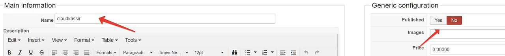

# CloudKassir модуль для Joomla - HikaShop
Модуль позволяет интегрировать онлайн-кассу [CloudKassir](https://cloudkassir.ru/) в интернет-магазин на платформе Joomla - HikaShop.

### Совместимость:
- Hikashop >= 3.4.0
- Joomla >= 3.8.2  

_Если вы используете платежный модуль CloudPayments совместно с модулем CloudKassir, то убедитесь, что в платежном модуле отключена отправка чеков через онлайн-кассу, во избежание дублирования кассовых чеков._  

Модуль тестировался на Hikashop = 3.4.0 (Joomla = 3.8.2)

### Возможности:
- Поддержка онлайн-касс (ФЗ-54);
- Автоматическая отправка чеков прихода по email и SMS;
- Отправка чеков возврата по email и SMS;

### Установка через панель управления
В панели адмниистратора перейдите в раздел "Расширения/Менеджер расширений/Установка"

После чего загрузите zip архив.  
Зайдите в управление плагинами. Убедитесь, что плагин включен.

### Настройка плагина
- Перейдите в настройки Hikashop  

- Далее необходимо выбрать способы оплаты   

- Нажать кнопку "Создать"  

- Выбрать  кассовый плагин  

- В качестве имени новой платежной системы указать: "cloudkassir" - **это обязательный пункт!!!**   

- Также выбираем "Опубликовать" - "нет"
- Далее введите "Public ID" - из личного кабинета мерчанта cloudpayments и пароль API, укажите нужные статусы для реагирования плагина на изменения заказа. Также обязательно указываем верный ИНН.
